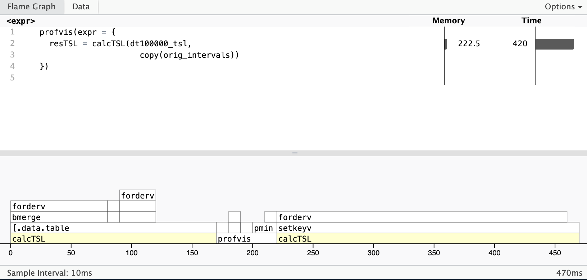
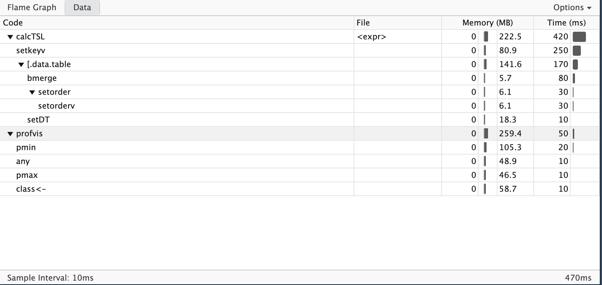
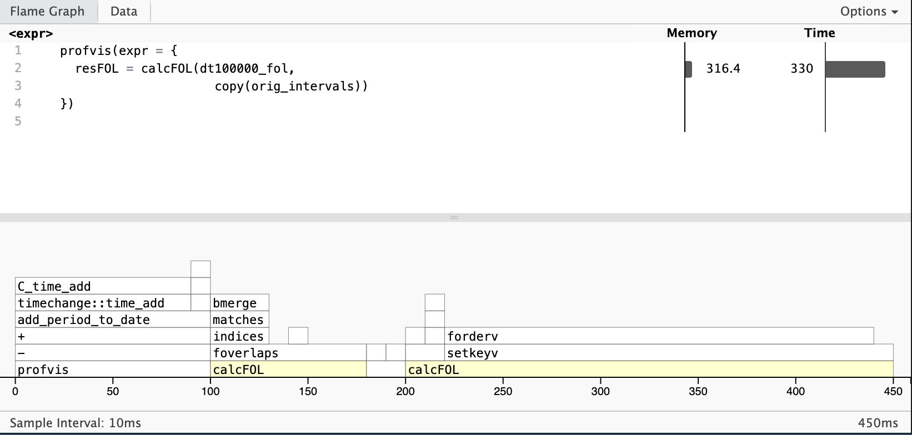
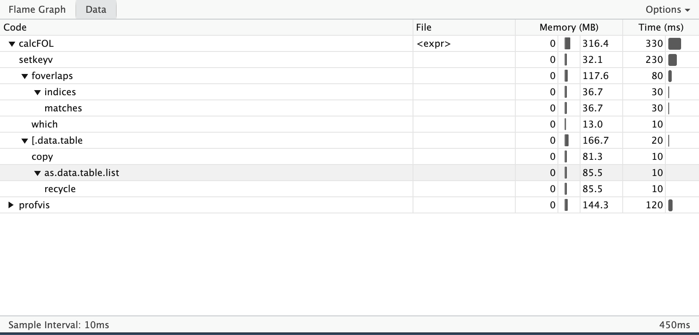

# Abstract

In this blog I will show you how to split time-slices in client-data so that each row will be reproduced as many times as there are overlaps with a given set of relevant intervals by also preserving the other relevant information of the rows. We will do this by using the **non-equi-join capabilities of the data.table package** together with some tweaks.

# Problem Definition

Lets repeat our problem from the previous [blog](https://thomasbrand77.github.io/r-solutions/posts/using-foverlaps-for-time-slices/)

In customer/client databases it is often the case that each row in a table has a validity from one date `startDate` to another date `endDate`. You have to interpret this row so that the information that are contained in other columns of this row are valid just from `startDate` to `endDate`.

These rows are referred to as time-slices.

::: callout-note
As an indication of time-slice without end (i.e. the end isn't known by now) you normally use a date far in the future, e.g. 9999-12-31 (the value often coming from a data base and not using the R-value `Inf)`.

It is as well useful for joining operations and calculations, that the `endDate` corresponds to the first Date where the slice isn't valid any more. In this way you can stitch together the slices of a person by the corresponding `startDate` to an `endDate`.
:::

In mathematical terms we have an interval, that is closed at the left and open at the right: $[a, b)$.

Let's look at some example-data.

```{r}
#| label: example-data
#| warning: false

library(data.table)
library(lubridate)
library(knitr)
library(kableExtra)
load("./client_data.Rdata")
orig_dt = copy(dt)
dt
```

This is of course a simplified example and a modified one compared to the previous blog in that we have now a client `D` whom we don't expect in the result because his time-slice starts after our interval of interest.

Our task will be to calculate the cumulative payments per plan for each month from September 2024 to March 2025. For this one possible solution would be to generate one line per costumer for each plan and each month. With this solution it will be easier to calculate the amount to pay for time slices, that don't start or end at the beginning of a month.

The correct results are as follows

```{r}
#| label: preview-result
#| echo: false
fresult
```

## Mathematical Concept

As mentioned in the [blog post](https://thomasbrand77.github.io/r-solutions/posts/using-foverlaps-for-time-slices/) using [foverlaps](https://rdatatable.gitlab.io/data.table/reference/foverlaps.html) for time slices

::: callout-important
By default the foverlaps-function used an overlap-mode "any" which will produce an overlap of two intervals $[a,b]$ and $[c,d]$ if $c\le b \wedge d\ge a$ . So all intervals are treated as closed intervals.
:::

We, on the other hand, are handling intervals, that are open on the right, i.e. $[a,b)$ and $[c,d)$ . So we are interested in the condition

$$c<b\wedge d>a$$

or equivalently if we would like to write the limits of the first interval always on the left side:

$$b>c\wedge a < d$$

which will represent the variables in the order of a non-equi-join of the data.table-syntax. This syntax requires the left hand side (LHS) to be a column from x and the right hand side (RHS) from i of the form

``` r
x[i, j, by, on] 
```

You can find more on joins with `data.table` here: <https://rdatatable.gitlab.io/data.table/articles/datatable-joins.html>

::: callout-note
For a detailed explanation of what you can do with the data.table-package please see

Barrett T, Dowle M, Srinivasan A, Gorecki J, Chirico M, Hocking T, Schwendinger B, Krylov I (2025). *data.table: Extension of 'data.frame'*. R package version 1.17.99, [https://r-datatable.com](https://r-datatable.com/).
:::

# Solution

## Step By Step Process

For the sake of clarity we have a situation where the begin- and end-columns in our data.table and for the intervals both have the same names, i.e. `startDate` and `endDate` respectively.

### Create the Interval data.table

First we create the data.table, that has all the monthly intervals we are interested in:

```{r}
#| label: creating-intervals

intervals = data.table(startDate = seq(as.Date("2024-09-01"), to = as.Date("2025-04-01"), by = "month"))
intervals[,endDate := shift(startDate, type = "lead")]
intervals = na.omit(intervals)
orig_intervals = copy(intervals)
intervals
```

### Creating Join-Columns

We have to copy the columns to join as these columns are only used for joining purposes and not for the final results

```{r}
#| label: creating-join-columns

# for intervals
intervals[,':='(i_startDate = startDate,
                i_endDate   = endDate)]

# for dt
dt[,':='(x_startDate = startDate,
         x_endDate   = endDate)]
```

::: callout-note
We used the prefixes "x\_" and "i\_" to denounce the data.tables they belong to which corresponds to the general data.table-syntax

``` r
x[i, j, by, on] 
```
:::

### Non-Equi-Join

Here comes the interesting part of the non-equi-join. Keep in mind, that for any interval in dt $[a,b)$ and in intervals $[c,d)$ we have to satisfy the condition

$$b>c\wedge a < d$$

```{r}
#| label: non-equi-join

result = dt[
  intervals,
  on = c("x_endDate > i_startDate",
         "x_startDate < i_endDate")
]
```

To better understand why we can't use the join-columns for our result let's look at some of the columns

```{r}
#| label: preliminary-results

head(result[,.(x_startDate, x_endDate, startDate, endDate, i.startDate, i.endDate)])
```

where

-   `x_startDate` and `x_endDate` are the results of the joining operation

-   `startDate` and `endDate` are the columns from the data.table `dt`

-   `i.startDate` and `i.endDate` are the columns from the data.table `intervals`

We can't use the `x_startDate` and `x_endDate` because the end is before the start. That is because the joined column-values are overwritten by the i-values of the join-columns.

But we have all the date information from the original data.table and the intervals, which we can use to construct the correct intervals:

```{r}
#| label: correction-of-intervals

result[,':='(startDate = pmax(startDate, i.startDate),
             endDate   = pmin(endDate,   i.endDate),
             x_startDate = NULL,
             x_endDate = NULL,
             i.startDate = NULL,
             i.endDate = NULL)]
setkeyv(result,c("client", "startDate","endDate"))
result
```

We can see, that it is equal to our required result

```{r}
#| label: compare-results

all.equal(fresult, result)
```

## All in One Function

For convenience let's build a function that does all this for us.

```{r}
#| label: function-definition

calcTSL = function(dt,
                   intervals,
                   cols_dt = c("startDate", "endDate"),
                   cols_intervals = c("startDate", "endDate")) {
  
  cols_cp = paste("cp",cols_dt, sep = ".")
  cols_i  = paste("i",cols_intervals, sep = ".")
  cols_cp_i = c(cols_cp, cols_i)
  
  # prepare intervals: generate join-columns
  intervals[,(cols_cp) := lapply(.SD, copy), .SDcols = cols_intervals]
  setkeyv(intervals, cols_cp)
  
  # repare dt: generate join-columns
  dt[,(cols_cp) := lapply(.SD, copy), .SDcols = cols_dt]
  
  
  result = dt[
    intervals,
    on = c(paste0(cols_cp[2]," > ",cols_cp[1]), 
           paste0(cols_cp[1]," < ",cols_cp[2]))
  ][, # programming on data.table
    ':='(start = pmax(start, i.start),
         end   = pmin(end,   i.end)),
    env = list(start   = cols_dt[1],
               end     = cols_dt[2],
               i.start = cols_i[1],
               i.end   = cols_i[2])
  ][, # delete unnecessary columns
    (cols_cp_i) := NULL
  ]
  
  # 
  setkeyv(result, c("client",cols_dt))
  
  return(result)
}

```

Let's test our function

```{r}
#| label: test-of-function

resultTSL = calcTSL(copy(orig_dt),
                    copy(orig_intervals))

all.equal(fresult, resultTSL)

```

::: callout-note
In this function we used the programming on data.tables capabilities of the data.table package. For further information on this topic I refer you to <https://rdatatable.gitlab.io/data.table/articles/datatable-programming.html>
:::

# Speed Comparison

Let's see how our Non-Equi-Join compares to foverlaps.

## Function with foverlaps

We create a function that does our calculation via foverlaps (please be aware that for a valid function with foverlaps we would build it more sophisticated, i.e. with more options)

```{r}
#| label: function-foverlaps

calcFOL = function(dt,
                   intervals) {
  
  dt[,endDatem1 := endDate - days(1)]
  intervals[,endDatem1 := endDate - days(1)]
  colsm1 = c("startDate","endDatem1")
  setkeyv(intervals, colsm1)
  
  # calculate the result
  result = foverlaps(dt, 
                     intervals, 
                     by.x = colsm1, 
                     by.y = colsm1,
                     nomatch = NULL)
  
  # correct for wrong startDate
  result[startDate < i.startDate, startDate := i.startDate]
  
  # only return the desired colums and set a key
  return(setkeyv(result[,.(client, plan, startDate, endDate, 
                          basicPrice, discount, toPayPerMonth)],
                c("client", "startDate", "endDate")))
}
```

When we compare the results, we see, that we get the same result

```{r}
#| label: compare-result-of-functions

resultFOL = calcFOL(copy(dt),
                    copy(intervals))

all.equal(fresult, resultFOL)
```

## Creating a large dt

For speed-tests we need a large data.table 500,000 rows.

```{r}
#| label: creating-large-dt

dt100000 = rbindlist(lapply(1:100000, \(i) {
  return(copy(orig_dt)[,client := paste0(client,i)])
}))

```

We measure the elapsed time for just one iteration

```{r}
#| label: benchmark
#| warning: false
#| 
dt100000_fol = copy(dt100000)
dt100000_tsl = copy(dt100000)

library(microbenchmark)

time_measure = microbenchmark(
  fol = {
    resFOL = calcFOL(dt100000_fol,
                     copy(orig_intervals))
  },
  tsl = {
    resTSL = calcTSL(dt100000_tsl,
                     copy(orig_intervals))
  },
times = 1L,
unit = "nanoseconds")

print(time_measure)
```

We can see, that the foverlaps-function and the non-equi-join-function needed more or less the same time with the microbenchmark-package. To better see where the non-equi-join loses against the foverlaps we can use the profvis package (by the way: the `setkeyv` used up more time than the joining operations).

```{r}
#| label: profile-of-non-equi-join
#| eval: false
dt100000_tsl = copy(dt100000)
profvis(expr = {
  resTSL = calcTSL(dt100000_tsl,
                     copy(orig_intervals))
})
```





```{r}
#| label: profile-of-foverlaps
#| eval: false
library(profvis)
dt100000_fol = copy(dt100000)
profvis(expr = {
  resFOL = calcFOL(dt100000_fol,
                     copy(orig_intervals))
})
```




